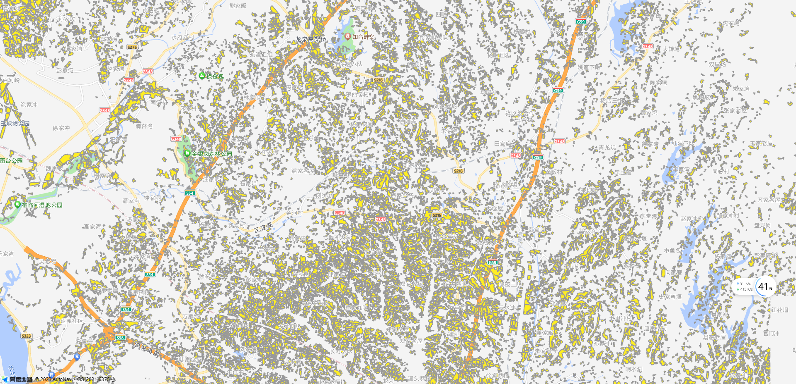

## AMap.MapboxVectorTileLayer

这个类可以用于加载 pbf 图层，并自定义图层里的 polygon，line，circle 等矢量图的属性，比如 color，bordercolor

> 高德 api 版本请使用 2.0,1.4.15 不支持这个类！！！！！！！

### 使用方法

#### 执行 `npm i `

> 这一步只是为了搭建个本地服务器。
> 如果你使用`VSCode`,可以直接在扩展里搜索安装`Live Server`,就可以快速搭建本地服务器了。

#### 提供高德 JSAPI 服务的 API_KEY 和 pbf 图层

`window.pbfUrl` 就是 pbf 图层链接，公司机密无法提供 demo 了，请自行替换即可

高德 jsapi 的 key 需要自己申请一下哈

### 效果图

